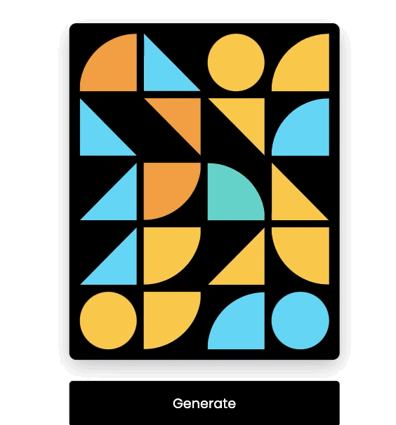

<!-- PROJECT LOGO -->
 

    
  </a>
  
  

    Gerador Aleatório de Formas Geométricas
  

  

    <a href="https://geometric-generator.vercel.app/" style="color:#66FF00; font-size:25px">
    Teste o projeto! Link do deploy ● ▲ ◥
    </a>
  

 

<!-- Sobre o projeto -->
# Sobre o projeto

Projeto desenvolvido com o objetivo de treinar formas geométricas no CSS e renderiza-las randomicamente com o javascript.

 

# Tecnologias utilizadas

* HTML
* CSS
* Javascript

 
